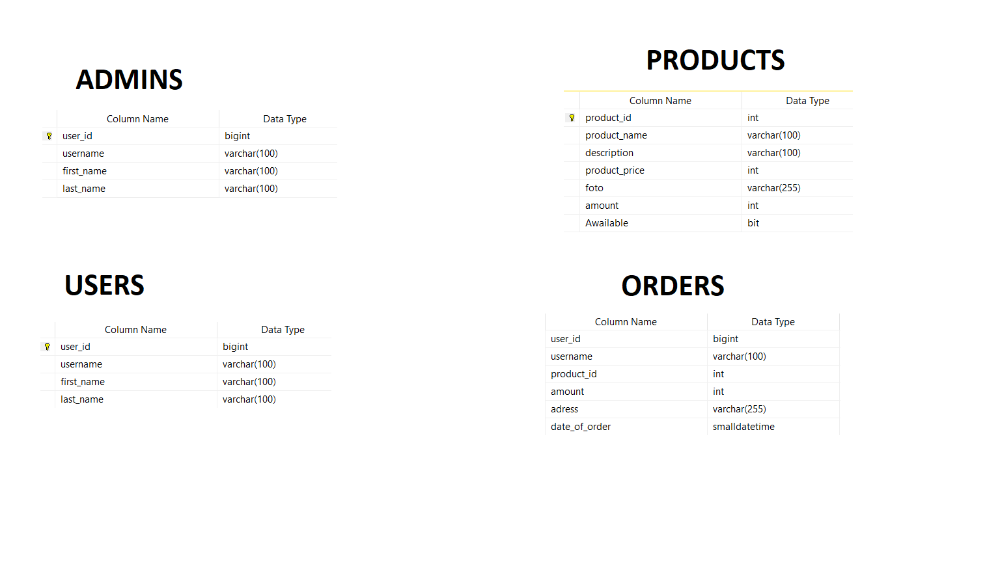

# Shop bot with MySQL server database
Hello everyone. This is my first bot for Telegram. 
I made it in March 2023 to automate process of Shop management.  
It was made without asynchronous libraries and frameworks, but with the help of MySQL server. 
All passwords were changed into nonsense for safety proposes. 
That is simple, not commercial project. 

## General information about data structure
I added to types of users: <strong>users</strong>(general customers) and <strong>admins</strong>(they can run the shop). 
There are 4 tables in my database:   
  
* Table USERS is collecting data from everyone who start the bot. 
* Table ADMINS store information about ADMINS of Shop. 
* Table PRODUCTS has information about all products, including photos. 
* Table ORDERS has information about all made orders.

## Tasks that could be done by that bot:
### For users in USERS table:
1. Every user can check information about himself with command /id. 
2. Every user can see only awailable products from PRODUCTS table with /awailable_products command. 
3. Every user can make order with /make_order command. 
4. Echo function for every other message. 
### For admins in ADMINS table:
1. Each admin has all users functions 
2. Each admin can see all products from PRODUCTS table with /all_products command. 
3. Each admin can see all orders from ORDERS table with /all_orders command. 
4. Each admin can add, delete and change products in PRODUCTS table. 
5. Each admin can see all users in USERS table with /add_product command. 
5. Admin can get a notification when new order from user is coming. 

## Storage
It could be run on a local device. But I used Google Cloud for that purpose. 
I found it useful, because it is not necessary to use laptop.
	
## Technologies
Project is created with the help of these libraries in Python 3.11.4:
* telebot
* datetime
* pyodbc

	
## Setup
To run this project, install it locally using git clone. 
After that, please enter your BOT TOKEN in passwords file, because mine is just a demonstration. 
Please enjoy!
